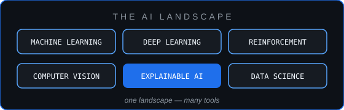

<!-- ────────────────────────  HERO  ──────────────────────── -->
<div align="center">


<br/>


<br/>

[](https://www.linkedin.com/in/b-sainath-reddy-097915321)
&nbsp;
[](mailto:bsainathreddy4@gmail.com)
&nbsp;
[](https://github.com/Sainath-Reddy7?tab=repositories)

</div>

---

## About Me

<table>
<tr>
<td valign="top" width="56%">

```python
class SainathReddy:

    role       = "AI & Robotics Student"
    but_mostly = "I build systems end-to-end"
    #             RL · XAI · drones · ICS security

    currently  = "reproducing papers — then extending them"
    open_to    = "internships & research collabs"

    def how_i_work(self):
        return ("understand the math, "
                "rebuild it from scratch, "
                "then make it run in the "
                "real world")
```

</td>
<td valign="middle" align="center" width="44%">


<sub><i>B Sainath Reddy · Coimbatore, India</i></sub>

</td>
</tr>
</table>

---

## Stack & Tools

<div align="center">


<br/>

<a href="https://scikit-learn.org"></a>
<a href="https://opencv.org"></a>
<a href="https://developers.google.com/mediapipe"></a>
<a href="https://shap.readthedocs.io"></a>
<a href="https://matplotlib.org"></a>
<a href="https://mujoco.org"></a>
<a href="https://gazebosim.org"></a>
<a href="https://ardupilot.org"></a>
<a href="https://pybullet.org"></a>
<a href="https://github.com/JaidedAI/EasyOCR"></a>

</div>

---

## What I'm About

<table>
<tr>
<td valign="middle" width="58%">

I work across the AI landscape — machine learning, deep learning,
reinforcement learning, vision — because real problems don't come
labeled with the technique that solves them.

What stays constant: clean data, sound math, honest evaluation, and
models that hold up outside the notebook. If a system works, I want
to know **why** it works — that's the difference between using AI
and engineering it.

</td>
<td valign="middle" align="center" width="42%">



<sub><i>one landscape, many tools — pick the right one for the problem.</i></sub>

</td>
</tr>
</table>

---

## Let's Connect

<div align="center">

Open to internships, research collaborations, and good problems worth solving.

<br/>

[](https://www.linkedin.com/in/b-sainath-reddy-097915321)
&nbsp;
[](mailto:bsainathreddy4@gmail.com)
&nbsp;
[](https://github.com/Sainath-Reddy7?tab=repositories)

</div>

<br/>


